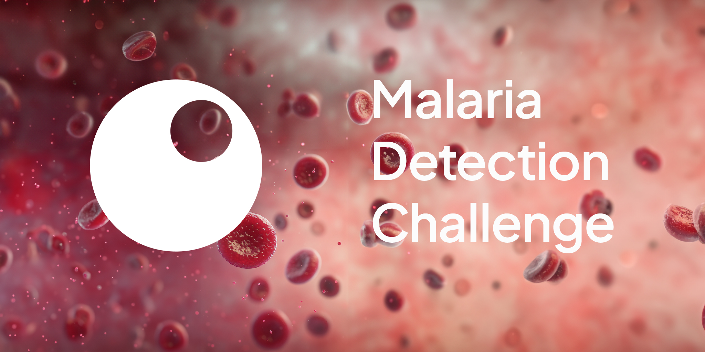

[](https://teamepoch.ai/competitions)
[](https://teamepoch.ai/)
[![Python Version](https://img.shields.io/badge/Python-3.10-4584b6.svg?logo=data:image/svg+xml;base64,PHN2ZyB4bWxucz0iaHR0cDovL3d3dy53My5vcmcvMjAwMC9zdmciIHdpZHRoPSI2NCIgaGVpZ2h0PSI2NCIgdmlld0JveD0iMCAwIDMyIDMyIj48ZGVmcz48bGluZWFyR3JhZGllbnQgaWQ9IkEiIHgxPSI4MTEuNTI3IiB5MT0iNTc0Ljg5NSIgeDI9IjY2NS4yNTUiIHkyPSI1NzMuNzMyIiBncmFkaWVudFVuaXRzPSJ1c2VyU3BhY2VPblVzZSI+PHN0b3Agb2Zmc2V0PSIwIiBzdG9wLWNvbG9yPSIjMzY2YTk2Ii8+PHN0b3Agb2Zmc2V0PSIxIiBzdG9wLWNvbG9yPSIjMzY3OWIwIi8+PC9saW5lYXJHcmFkaWVudD48bGluZWFyR3JhZGllbnQgaWQ9IkIiIHgxPSI4NjIuODI0IiB5MT0iNjQyLjE3NiIgeDI9IjU3My4yNzYiIHkyPSI2NDIuMTc2IiBncmFkaWVudFVuaXRzPSJ1c2VyU3BhY2VPblVzZSI+PHN0b3Agb2Zmc2V0PSIwIiBzdG9wLWNvbG9yPSIjZmZjODM2Ii8+PHN0b3Agb2Zmc2V0PSIxIiBzdG9wLWNvbG9yPSIjZmZlODczIi8+PC9saW5lYXJHcmFkaWVudD48L2RlZnM+PGcgdHJhbnNmb3JtPSJtYXRyaXgoLjE2MTcgMCAwIC4xNTgwODkgLTEwNy41Mzc2NCAtODEuNjYxODcpIj48cGF0aCBkPSJNNzE2LjI1NSA1NDQuNDg3YzAtMTMuNjIzIDMuNjUzLTIxLjAzNCAyMy44MjItMjQuNTYzIDEzLjY5My0yLjQgMzEuMjUtMi43IDQ3LjYyNyAwIDEyLjkzNSAyLjEzNSAyMy44MjIgMTEuNzcgMjMuODIyIDI0LjU2M3Y0NC45NDVjMCAxMy4xODItMTAuNTcgMjMuOTgtMjMuODIyIDIzLjk4aC00Ny42MjdjLTE2LjE2NCAwLTI5Ljc4NyAxMy43ODItMjkuNzg3IDI5LjM2M3YyMS41NjRoLTE2LjM3NmMtMTMuODUyIDAtMjEuOTE3LTkuOTg4LTI1LjMwNS0yMy45NjQtNC41Ny0xOC43NzYtNC4zNzYtMjkuOTYzIDAtNDcuOTQ1IDMuNzk0LTE1LjY4NyAxNS45MTctMjMuOTY0IDI5Ljc3LTIzLjk2NGg2NS41MnYtNmgtNDcuNjQ1di0xNy45OHoiIGZpbGw9InVybCgjQSkiLz48cGF0aCBkPSJNODExLjUyNyA2ODguMzJjMCAxMy42MjMtMTEuODIzIDIwLjUyMy0yMy44MjIgMjMuOTY0LTE4LjA1MiA1LjE4OC0zMi41NCA0LjM5NC00Ny42MjcgMC0xMi42LTMuNjctMjMuODIyLTExLjE3LTIzLjgyMi0yMy45NjR2LTQ0Ljk0NWMwLTEyLjkzNSAxMC43ODItMjMuOTggMjMuODIyLTIzLjk4aDQ3LjYyN2MxNS44NjQgMCAyOS43ODctMTMuNzEgMjkuNzg3LTI5Ljk2M3YtMjAuOTY0aDE3Ljg1OGMxMy44NyAwIDIwLjQgMTAuMzA1IDIzLjgyMiAyMy45NjQgNC43NjQgMTguOTcgNC45NzYgMzMuMTU3IDAgNDcuOTQ1LTQuODE3IDE0LjM2NC05Ljk3IDIzLjk2NC0yMy44MjIgMjMuOTY0SDc2My45djZoNDcuNjI3djE3Ljk4eiIgZmlsbD0idXJsKCNCKSIvPjxwYXRoIGQ9Ik03MjguMTY2IDU0MS41MDVjMC00Ljk3NiAzLjk4OC05IDguOTMtOSA0LjkyMyAwIDguOTMgNC4wMjMgOC45MyA5IDAgNC45Ni00LjAwNiA4Ljk4Mi04LjkzIDguOTgyLTQuOTQgMC04LjkzLTQuMDIzLTguOTMtOC45ODJ6bTUzLjU5IDE0OS43OThjMC00Ljk2IDQuMDA2LTguOTgyIDguOTMtOC45ODIgNC45NCAwIDguOTMgNC4wMjMgOC45MyA4Ljk4MiAwIDQuOTc2LTMuOTg4IDktOC45MyA5LTQuOTIzIDAtOC45My00LjAyMy04LjkzLTl6IiBmaWxsPSIjZmZmIi8+PC9nPjwvc3ZnPg==)](https://www.python.org/downloads/)
[](https://zindi.africa/)


# Lacuna Malaria Detection Challenge

This is Team Epoch's solution to the [Lacuna Malaria Detection Challenge](https://zindi.africa/competitions/lacuna-malaria-detection-challenge), hosted by Zindi. 

A technical report will be written and uploaded after the competition finale.

## Getting started

This section contains the steps that need to be taken to get started with our project and fully reproduce our best
submission on the public and private leaderboard. The project was developed on Linux 6.8.0-48-generic, and on Python 3.10.14 on Pip version 22.0.2.

### 0. Prerequisites
Models were trained on machines with the following specifications:
- CPU: AMD Ryzen Threadripper Pro 3945WX 12-Core Processor / AMD Ryzen 9 7950X 16-Core Processor
- GPU: NVIDIA RTX A5000 / NVIDIA RTX Quadro 6000 / NVIDIA RTX A6000
- RAM: 96GB / 128GB
- OS: Linux 6.8.0-48-generic
- Python: 3.10.14
- Estimated training time: 7-8 hours for the DETR, 2-3 hours for YOLO.

For running inference, a machine with at least 32GB of RAM is recommended.

### 1. Clone the repository

Make sure to clone the repository with your favourite git client or using the following command:

```
https://github.com/TeamEpochGithub/ZindiLacunaMalaria.git
```

### 2. Install Python 3.10.13

You can install the required python version here: [Python 3.10.13](https://github.com/adang1345/PythonWindows/tree/master/3.10.14)

### 3. Install the required packages

Install the required packages (on a virtual environment is recommended) using the following command:

```
pip install -r requirements.txt
```

### 4. Setup the competition data

The data of the competition can be downloaded here: [Lacuna Malaria Detection Challenge](https://zindi.africa/competitions/lacuna-malaria-detection-challenge/data)

Unzip all csv files into the `data/csv_files` directory, and all images into the `data/img` directory.

The structure should look like this:

```
data/
    ├── csv_files/
    ├── img/
    
```

### 5. Main file explanation

- `main.py`: This code preprocesses the training dataset by filtering redundant bounding boxes, trains YOLO and DETR models using configuration files, and trains a separate NEG model. It performs inference on test images using these models and Test Time Augmentation (TTA). The NEG predictions are saved in a CSV file and YOLO/DETR predictions in separate CSV files for each model. The results are stored in the data/predictions folder, with filenames indicating the model and split. The csv files are post processed, and saved in submissions/final_submission.csv.

## Contributors

This repository was created by [Team Epoch V](https://teamepoch.ai/team#v), based in the [Dream Hall](https://www.tudelft.nl/ddream) of the [Delft University of Technology](https://www.tudelft.nl/).

Read more about this competition [here](https://teamepoch.ai/competitions).

[](https://github.com/MarJarAI)
[](https://github.com/madhavv197)
[](https://github.com/FBB0)
[](https://github.com/Blagues)
